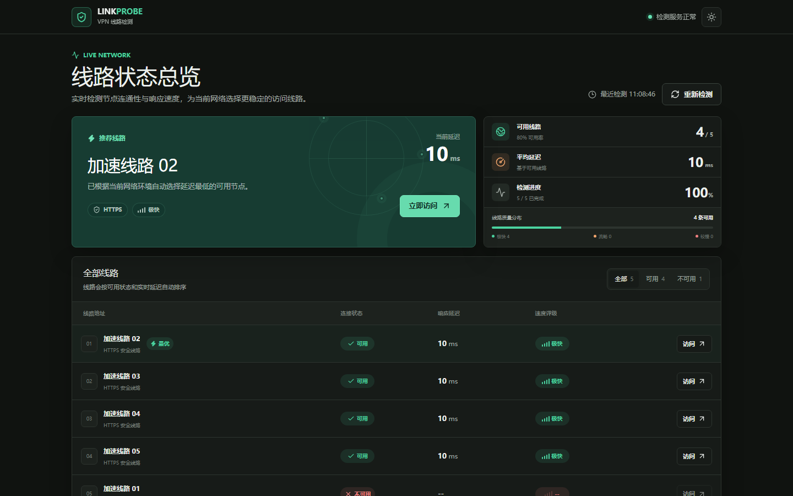
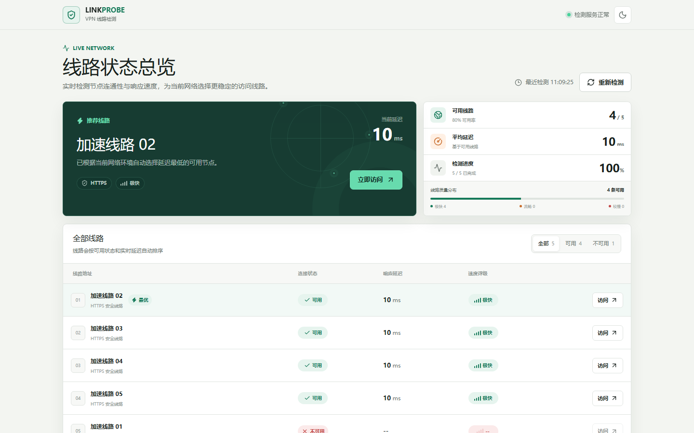
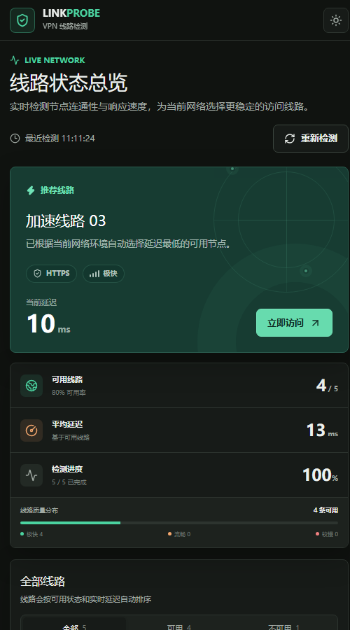

# VPNLine Checker

一个轻量、响应式的 VPN 线路检测页面。它会从访问者当前网络实时测试线路连通性与响应时间，自动排序结果，并推荐最快的可用入口。

**在线访问：** [https://qwer8856.github.io/VPNLine_Checker/](https://qwer8856.github.io/VPNLine_Checker/)

## 页面预览

### 桌面端 · 深色



### 桌面端 · 亮色



### 移动端



## 功能

- 自动并发检测线路连通性
- 根据响应时间推荐最快入口
- 检测过程中即可访问已完成的可用线路
- 展示可用率、平均延迟、检测进度与质量分布
- 支持状态筛选、列表展开及重新检测
- 支持深色、亮色主题
- 适配桌面、平板和手机屏幕
- 自动透传访问链接中的 `code` 参数

## 本地运行

环境要求：Node.js `22.13.0` 或更高版本。

```bash
npm ci
npx vite
```

打开终端输出的本地地址即可预览。

## 线路配置

线路入口集中维护在 `app/line-config.ts`。数组中的每一行对应一个入口，增删后页面会自动更新检测数量和结果列表。

协议前缀由检测程序自动补齐，配置项中只需填写入口地址。

## 检测方式

页面使用浏览器端 `fetch` 请求测试入口是否可达，并记录收到响应前的耗时：

- 单次超时为 4.5 秒
- 同时检测 3 条线路
- 禁用浏览器请求缓存
- 同时尝试 HTTPS 与 HTTP

检测结果反映访问者当前网络环境，不代表所有地区或运营商的统一状态。

## 技术栈

- React 19
- TypeScript
- Vite / Vinext
- Tailwind CSS 4
- Lucide Icons

## 构建

```bash
npx vite build
```

需要修改检测域名或构建静态网站时，请参阅 [DEPLOYMENT.md](DEPLOYMENT.md)。
